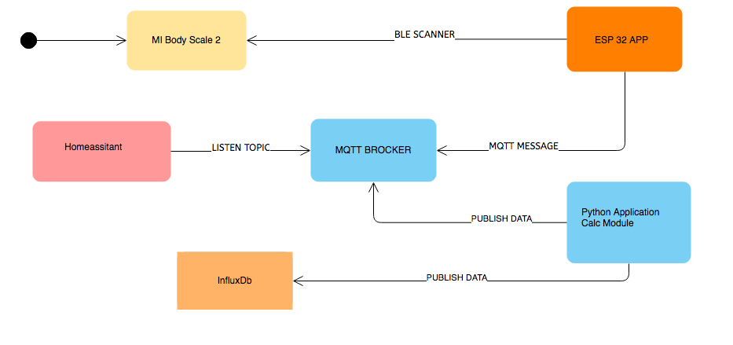

# Connector for Xiaomi Mi Scale - Develop Version

## Body Composition Scale 2 (XMTZC05HM) Data to MQTT / Influxdb
Code to read weight measurements from Xiaomi Body Scales.




## Prerequisites

An MQTT broker is needed as the counterpart for this daemon. Even though an MQTT-less mode is provided, it is not recommended for normal smart home automation integration. MQTT is huge help in connecting different parts of your smart home and setting up of a broker is quick and easy.

- Body Composition Scale 2 (XMTZC05HM)

- ESP32 (BLE SCANNER),  see  [ESP32 Application](esp32/README.md)

- Raspberry or Linux computer

- Python 3 (min)

- MQTT broker

- Libs see requirements.txt

- Optional Homeassistant, see [Settings & Views Homeassistant](docs/homeassistant/README.md)

- Optional influxdb, see  [Influx DB & Grafana Dashboard](docs/influxdb/README.md)

  

## Installation

On a modern Linux system just a few steps are needed to get the daemon working. The following example shows the installation under Debian/Raspbian below the `/opt` directory:


```bash
$ su -
$ cd /opt/
$ git clone https://github.com/zibous/ha-miscale2.git
$ cd /opt/ha-miscale2
$ sudo pip3 install -r requirements.txt

```

To match personal needs, all operation details can be configured using the file **conf.py** The file needs to be created first:

```bash
$ cd /opt/ha-miscale2
$ cp conf.py.dist conf.py

# edit configuration settings
$ nano conf.py

$ chmod +x app.py
$ chmod +x mqttservice.py
$ chmod +x service.sh
$ chmod +x service_mqtt.sh

## tests
$ python3 app.py
$ ./app.py
$ ./app.py && tail -f /var/log/syslog | grep MIBCS2

$ python3 mqttservice.py
$ ./mqttservice.py && tail -f /var/log/syslog | grep MIBCS2

```


## Application for Raspberry / Linux computer

Read [Xiaomi Mi Body Composition Scale](https://www.mi.com/global/mi-body-composition-scale) data from a Raspberry Pi in Python 3.

### Execution
`python3 app.py`

## MQTT service for ESP32 Devices
A simple Python script which provides a MQTT gateway for ESP Devices, easily extensible via custom workers. Application for ESP Devices see:

Details see :  [ESP 32 Appliciaton]( esp32/README.md)


## Configuration

You most probably want to execute the program **continuously in the background**. This can be done either by using the internal daemon or cron.

Systemd service for  - on systemd powered systems the **recommended** option

### Application Service:
   ```bash
   $ sudo cp /opt/ha-miscale2/service_app.template /etc/systemd/system/ha-miscale.service
   
   $ sudo systemctl daemon-reload
   $ sudo systemctl start ha-miscale.service
   $ sudo systemctl stop ha-miscale.service
   $ sudo systemctl status ha-miscale.service
   
   $ sudo systemctl enable ha-miscale.service
   ```

### MQTT Service:
   ```bash
   $ sudo cp /opt/ha-miscale2/service_mqtt.template /etc/systemd/system/ha-miscale-mqtt.service
   
   $ sudo systemctl daemon-reload
   $ sudo systemctl start ha-miscale-mqtt.service
   $ sudo systemctl status ha-miscale-mqtt.service
   
   $ sudo systemctl enable ha-miscale-mqtt.service
   ```
<br/>

## MQTT Data for Homeassistant / Applications

The calculation results are saved once as a history in the data folder, published as an MQTT payload and optionally saved in the defined InfluxDB.

**Sample MQTT Payload**

Topic: `tele/miscale2/Peter/measured`<br>
These data are published by the "ESP32 Application" and can either be processed directly in another application. In my case, this data is evaluated via the Python application and the additional data is calculated and then published (Infuxdb, Homeassistant).
```json
{
	"user": "Peter",
	"sex": "male",
	"athletic": true,
	"age": 64.85,
	"weight": 68.2,
	"unit": "kg",
	"impedance": 539,
	"bmi": 22.27,
	"water": 43.11,
	"fat": 18.4,
	"timestamp": "2020-10-05 06:23:03",
	"version": "1.0.1",
	"icon": "mdi:scale-bathroom",
	"attribution": "Data provided by Peter Siebler"
}
```

Topic: `tele/miscale2/Peter/data` <br/>
This data is published by the "calc module"
```json
{
   "measured":70.65,
   "calcweight":70.65,
   "unit":"kg",
   "impedance":485,
   "timestamp":"2020-09-18T06:34:29Z",
   "scantime":"2020-09-18 08:34:29",
   "user":"Peter",
   "sex":"male",
   "athletic":true,
   "age":64.8,
   "metabolic_age":40.39,
   "bmi":23.07,
   "bodytype":"balanced",
   "weight":70.65,
   "idealweight":66.5,
   "lbm":55.76,
   "fat":13.14,
   "fattype":"to_gain",
   "idealfat":1.98,
   "visceral":7.39,
   "water":55.72,
   "bone":3.64,
   "muscle":52.17,
   "protein":20.47,
   "bmr":1222.9,
   "targetweight":68.0,
   "icon":"mdi:scale-bathroom",
   "attribution":"Data provided by Peter Siebler"
}
```
<br/>


Topic: `tele/miscale2/Peter/scores` <br/>
This data is published by the "calc module"
```json
{
	"user": "Peter",
	"score": 90.0,
	"deltas": {
		"weight": -0.8,
		"fat": -0.21,
		"water": 0.0,
		"muscle": 0.0,
		"visceral": -0.4,
		"protein": 0.02
	},
	"states": {
		"weight": "Abgenommen",
		"fat": "Abgenommen",
		"water": "Keine Ver\u00e4nderung",
		"muscle": "Abgenommen",
		"protein": "Zugenommen"
	},
	"scores": {
		"bmi": 0.0,
		"fat": 10.0,
		"visceral": 0.0,
		"muscle": 0.0,
		"water": 0.0,
		"bones": 0.0,
		"bmr": 0.0,
		"protein": 0.0
	},
	"caloric": {
		"caloricmin": 2100,
		"caloricmax": 2400,
		"deficitmin": 1677,
		"deficitmax": 1923
	},
	"engergieexp": 2491,
	"macronut": { "protein": 872.0, "carbohydrates": 1246.0, "fat": 374.0 },
	"version": "1.0.1",
	"timestamp": "2020-10-05 06:23:03",
	"icon": "mdi:scale-bathroom",
	"attribution": "Data provided by Peter Siebler"
}

```
<br>

<br>
<hr>
 

# Acknowledgements:

+ Thanks @lolouk44 to https://github.com/lolouk44/xiaomi_mi_scale<br>
+ Formulas to calculate the various values/measures, I've got them from https://github.com/wiecosystem/Bluetooth


# Informations
- https://inbodyusa.com/general/technology/<br>
- https://github.com/limhenry/web-bluetooth-mi-scale<br>
- https://www.medeia.com/dtr_bioscan_bia.htm<br>
- https://www.jstor.org/stable/41463874<br>
- https://www.wikihow.fitness/Determine-Lean-Body-Mass<br>
- https://www.omnicalculator.com/health/body-fat#how-to-calculate-body-fat<br>
- https://calculator-online.net/ideal-weight-calculator/<br>
- https://en.wikipedia.org/wiki/Body_mass_index<br>
- https://www.calculator.net/bmi-calculator.html<br>
- https://www.calculator.net/calorie-calculator.html<br>
- https://www.omnicalculator.com/health/bmr-katch-mcardle#what-is-the-katch-mcardle-calculator<br>
- https://www.omnicalculator.com/health/maintenance-calorie<br>
- https://en.wikipedia.org/wiki/Body_water<br>
- https://de.wikipedia.org/wiki/Ponderal-Index<br>
- https://en.wikipedia.org/wiki/Body_fat_percentage<br>
- https://en.wikipedia.org/wiki/Lean_body_mass<br>
- http://elsenaju.de/AMI-Rechner.html<br>
- http://elsenaju.de/Kalorien-Bedarf-Rechner.html<br>
- https://www.calculator.net/lean-body-mass-calculator.html<br>
- http://www.dev.egofit.de/biadata-org/<br>
- https://github.com/zewelor/bt-mqtt-gateway<br>
- https://www.mi.com/global/mi-body-composition-scale<br>
- https://dev.to/henrylim96/reading-xiaomi-mi-scale-data-with-web-bluetooth-scanning-api-1mb9<br>
- https://github.com/Wingjam/ReverseMiScale/blob/master/miScale.py<br>
- https://tanita.de/hilfe-und-anleitungen/richtige-interpretation-ihrer-messwerte/<br>
- https://github.com/oliexdev/openScale<br>
- https://support.withings.com/hc/en-us/articles/218500778-Body-What-are-the-normal-ranges-for-body-composition-<br>
- https://googlechrome.github.io/samples/web-bluetooth/scan.html<br>
- https://github.com/IanHarvey/bluepy/blob/master/docs/scanner.rst<br>
- https://passionhome.sg/xiaomi-mi-body-composition-scale-v2-tips-and-instructions/ <br>
- https://github.com/rando-calrissian/esp32_xiaomi_mi_2_hass<br>
- https://github.com/limhenry/web-bluetooth-mi-scale<br>

# Omron, Medisana, Xiaomi
- https://www.amazon.de/Omron-HBF-511B-E-Ganzkörperanalyse-Waage-BF511-blau/dp/B0033AGBW0<br>
- https://www.amazon.de/Medisana-TargetScale-3-0-Waage/dp/B01MZ1VBWZ/<br>
- https://www.amazon.de/Xiaomi-Smart-Bluetooth-Monitor-Display/dp/B07WNM9B57/<br>
