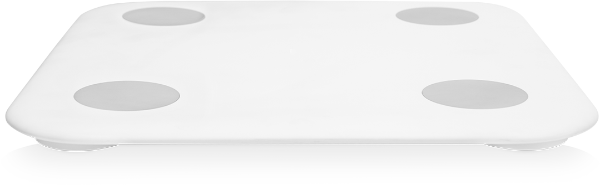

# Documentations / Informations

## Folder homeassistant
Holds the settings for the MI Scale Sensors and Lovlace Dashboards

# Folder infuxdb
The images of the Grafana dashboard and the settings for the dashboard are saved here

 

### Applications States Diagram - app_stats.png

PDF files that contain information about the various calculation methods.

## Scales used so far

|   Scale  | Picture                                                              |
|---- | ------------------------------------------------------------ |
| Targetscale     |  |
| Omron    |    |      |
| Mi Scale 2    |  |      |

