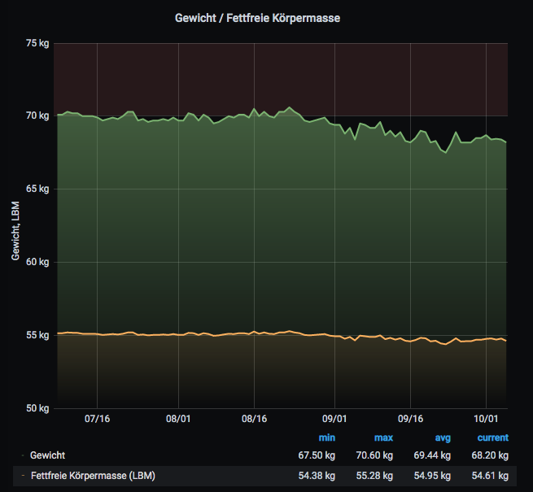
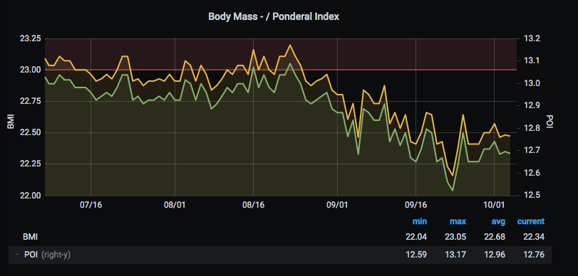
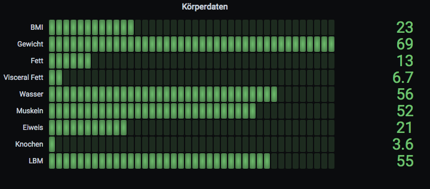
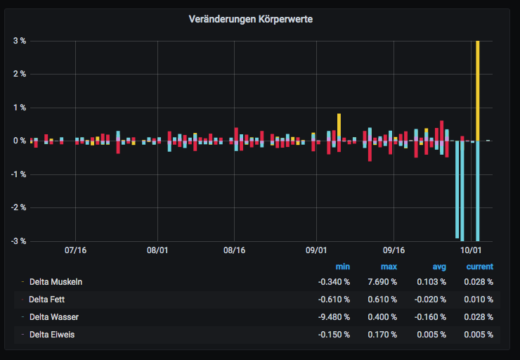
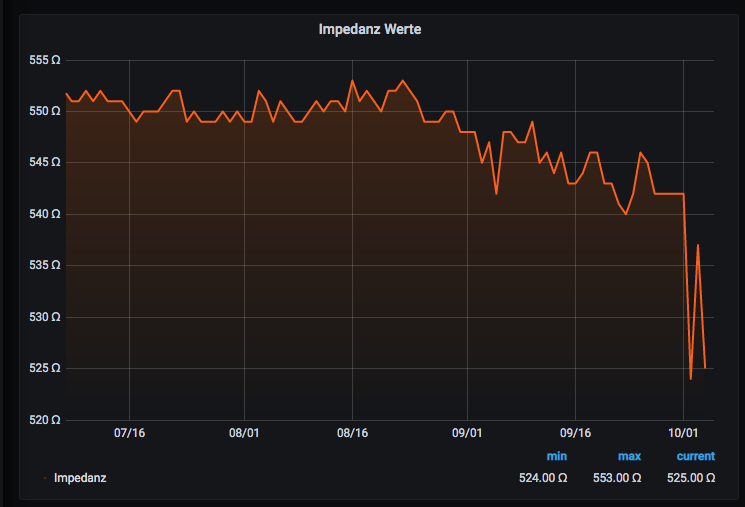
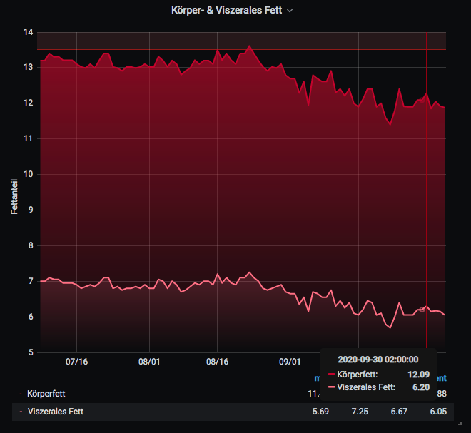
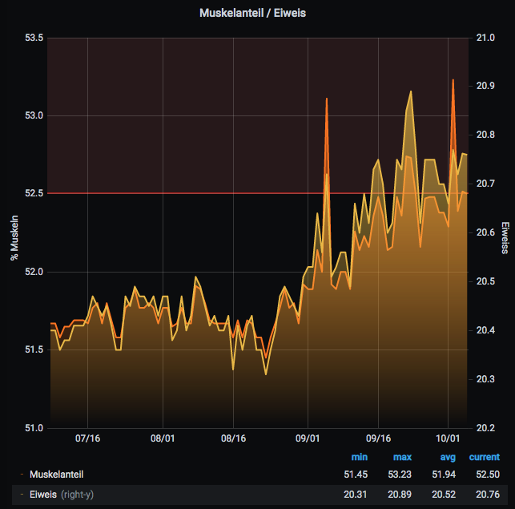
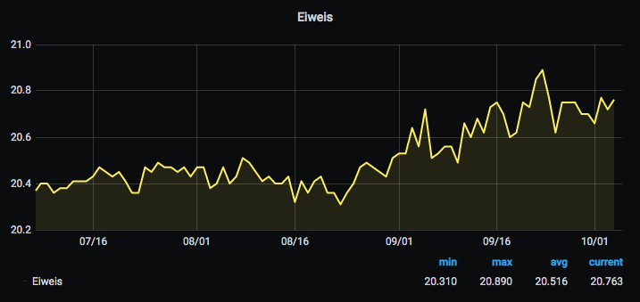
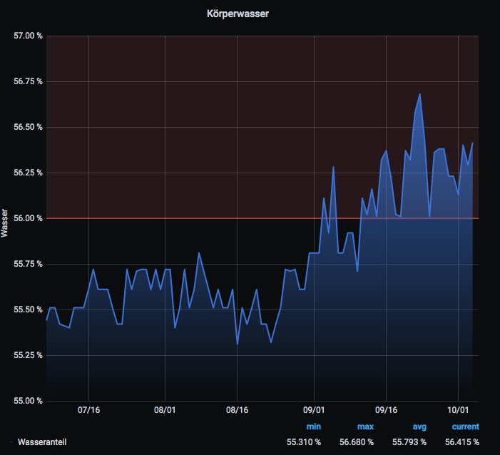

# Influx Database

The Modul calcdata.py m is built to collect information from mi scale and send it to InfluxDB. The eventual goal in creating this program was to provide body data metrics and alerts to Grafana.


## Prepare Database
```bash
$ influx
# Connected to http://localhost:8086 version 1.8.2
# InfluxDB shell version: 1.8.2
CREATE DATABASE historydata
...
exit
```

## Remove Measurment
```bash
# connect to influxdb
$ influx
show databases
use historydata
# Using database historydata
show measurements
drop measurement MISCALEDATA_USERNAME
....
exit
```

## Import previous scale data to the influxdb
```bash
$ cd tests
$ python3 updateInfluxdb.py
```


Publish Data to Influx DB

see: updateInfluxdb.py

```python
.....

# initialize the calc module with the data from the csv file
  mCalc = calcdata.CalcData(scaledata, True)

  # get the userdata
  mi_userdata = mCalc.getUserData()

  # calculate all miscale data
    log.info('Calcluation for user :{}, Date:{}'.format(mi_userdata['name'], scaledata['timestamp']))

    mi_data = mCalc.getData('alldata')
    
    if mCalc.ready:
    # publish data to influxdb
    datasections = {
       "influxdb": True
                }
    mCalc.publishdata(datasections)

...
```


## Grafana Dashboard - Charts


## 

























<br><hr>

## Information
- https://www.influxdata.com/blog/getting-started-python-influxdb/<br>
- https://github.com/influxdata/influxdb-python <br>
- https://github.com/influxdata/influxdb-python/blob/master/examples/tutorial_server_data.py<br>