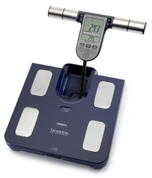
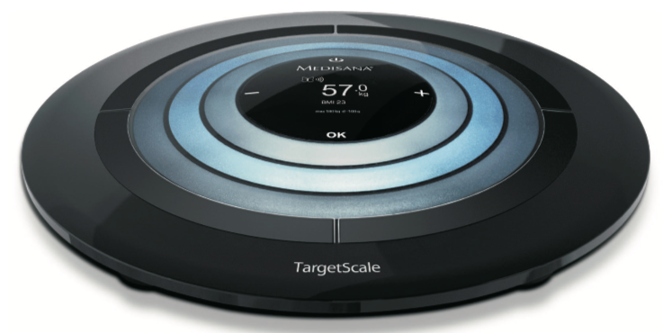
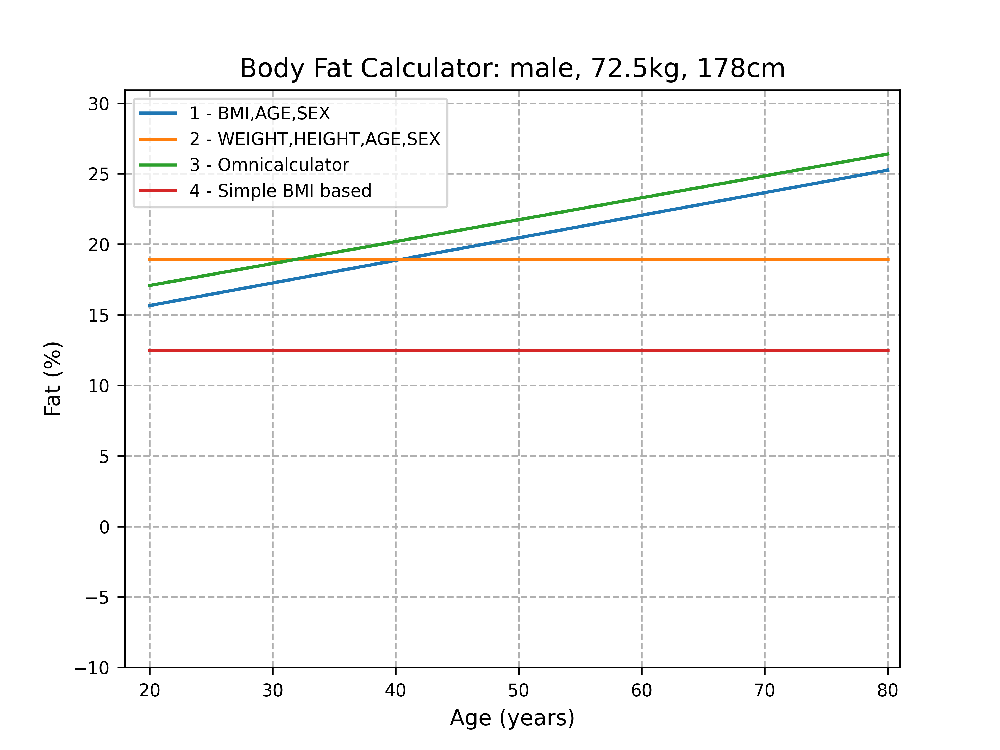
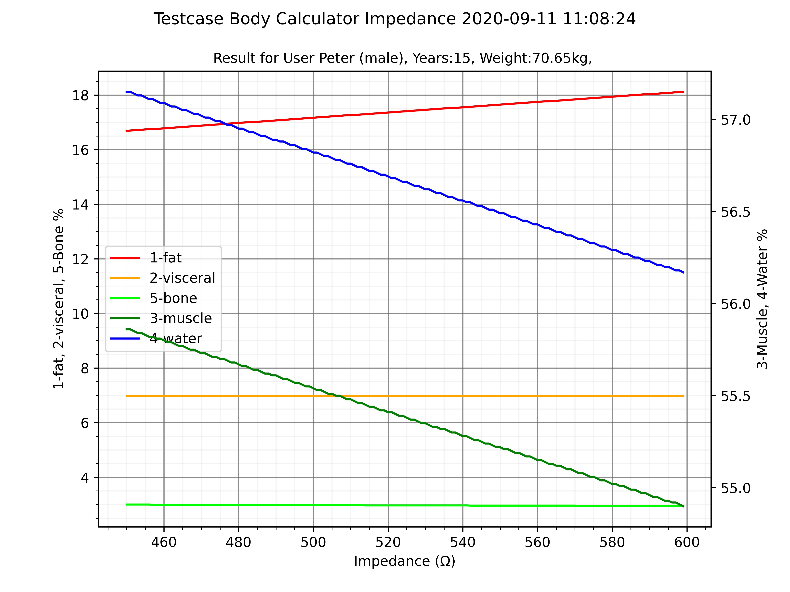

# Libraries for the application

Libraries from @Wi Ecosystem (https://github.com/wiecosystem/Bluetooth)

- body_metrics 
- body_scales
- body_core 

The implementation of the formulas are correct as far as I have checked, 
but do not deliver the desired results. 


> ## Body Score
>
> The body score is basically 100 - malus, where malus is the sum of a  sub-score computed for every data point (bmi, muscle mass, fat  percentage, etc). Each score is mostly based on the scales (where "normal" or "good" gives no malus, being way over the limits gives you maximum malus, and being  in between gives you a variable malus), but sometime, it's even more  precise than the scales (for example, for body fat, even being "normal"  is not enough, you need to be in the first half of "normal", or even  "low"). You can refer to `body_score.py` if you want more details on the algorithms.
>
> see:  https://github.com/wiecosystem/Bluetooth/blob/master/doc/devices/huami.health.scale2.md

In summary:

- The formulas do not take into account the body type and have no possibility to set an atheltic option.
- The age has too high a weighting in the calculations.
- The analysis shows that the fat values, muscles are too high, water, bones too low are calculated.
- Other libraries / calculation formulas or also applications show the same (wrong) results.

I only determined correction factors and in the future I will get the same values with the Mi Body Composition Scale 2 as with the other scales.
|        Omron               |   TargetScale                         |
|--------------------------- | --------------------------------------|
|  | |


<br>

### Results Testcases






## Workaround

Fortunately, I have over 2000 measurements from the past. With the cross-check of the recorded data and the calculated data, 

For this I have adjusted the user settings (see conf.py) and use the determined factors to correct the values:

```python
USER2_LT = 60
USER2_SEX = "female"
USER2_NAME = "Reni"
USER2_HEIGHT = 168
USER2_IDEALWEIGHT = 54.00
USER2_IDEALFAT = 18.50
USER2_ATHLETIC = True
USER2_DOB = "2004-01-02"
USER2_ADJUSTMENTS = {
    "77": {"fat": 0.756, "visceral": 0.545, "water": 1.187, "bone": 1.276, "muscle": 0.758},
    "78": {"fat": 0.766, "visceral": 0.552, "water": 1.186, "bone": 1.271, "muscle": 0.750},
    "76": {"fat": 0.745, "visceral": 0.536, "water": 1.188, "bone": 1.285, "muscle": 0.767},
    "75": {"fat": 0.736, "visceral": 0.530, "water": 1.190, "bone": 1.294, "muscle": 0.777},
    "74": {"fat": 0.638, "visceral": 0.460, "water": 1.045, "bone": 1.312, "muscle": 0.823},
    "73": {"fat": 0.634, "visceral": 0.457, "water": 1.044, "bone": 1.317, "muscle": 0.823},
    "72": {"fat": 0.593, "visceral": 0.427, "water": 1.052, "bone": 1.321, "muscle": 0.839},
    "71": {"fat": 0.604, "visceral": 0.435, "water": 1.044, "bone": 1.331, "muscle": 0.845},
    "70": {"fat": 0.587, "visceral": 0.423, "water": 1.044, "bone": 1.304, "muscle": 0.857},
    "69": {"fat": 0.586, "visceral": 0.422, "water": 1.044, "bone": 1.304, "muscle": 0.858},
    "68": {"fat": 0.566, "visceral": 0.408, "water": 1.217, "bone": 1.300, "muscle": 0.883},
    "67": {"fat": 0.552, "visceral": 0.398, "water": 1.215, "bone": 1.304, "muscle": 0.895},
    "66": {"fat": 0.542, "visceral": 0.390, "water": 1.040, "bone": 1.328, "muscle": 0.906},
    "65": {"fat": 0.528, "visceral": 0.380, "water": 1.039, "bone": 1.296, "muscle": 0.919},
    "64": {"fat": 0.508, "visceral": 0.366, "water": 1.035, "bone": 1.306, "muscle": 0.936},
    "63": {"fat": 0.491, "visceral": 0.354, "water": 1.035, "bone": 1.311, "muscle": 0.945},
    "62": {"fat": 0.560, "visceral": 0.403, "water": 1.014, "bone": 1.326, "muscle": 0.948}
}
```
The USER {n} _ADJUSTMENTS are only used if they are available and USER {n} _ATHLETIC is set to TRUE.

```python
    def __recalibrate__(self):
        # Only used for athletic mode
        if self.adjustments and self.athletic:
            idx = self.round_to_value(self.weight)
            if idx in self.adjustments:
                cf = self.adjustments[idx]
                self.data['fat'] = round(float(self.data['fat']) * float(cf['fat']), 2)
                self.data['visceral'] = round(float(self.data['visceral']) * float(cf['visceral']), 2)
                self.data['water'] = round(float(self.data['water']) * float(cf['water']), 2)
                self.data['bone'] = round(float(self.data['bone']) * float(cf['bone']), 2)
                self.data['muscle'] = round(float(self.data['muscle'])*float(cf['muscle']),2)
```

Source 
  https://github.com/wiecosystem/Bluetooth/tree/master/sandbox/huami.health.scale2<br>

Informations
  https://github.com/wiecosystem/Bluetooth/blob/master/doc/devices/huami.health.scale2.md


<br>
<hr size="1">
<br>

### Mi Body Composition Scale Libs
- miscale2.py
  Is used to evaluate the data of the balance and to transfer it to the calculation modules.
- calcdata.py
  Calculation module for the measurement results. Used once in the application and also in the MQTT service.
  <br><br>
  Example:
 
  ```python
    data = {
        "measured": 70.65,
        "calcweight": 70.65,
        "unit": 'kg',
        "impedance": 485,
        "timestamp": str(datetime.today().strftime('%Y-%m-%d %H:%M:%S')),
        "scantime": str(datetime.today().strftime('%Y-%m-%d %H:%M:%S'))
    }
    log.info('Calcluation based on data:{}'.format(data))
    mCalc = calcdata.CalcData(data, True)
    mi_data = mCalc.getData('data')
    if mCalc.ready:
         mCalc.publishdata()
    else:
        log.error("No data present !")
  ```
- logger.py and influxdb.py
  Helper modules for the application 

